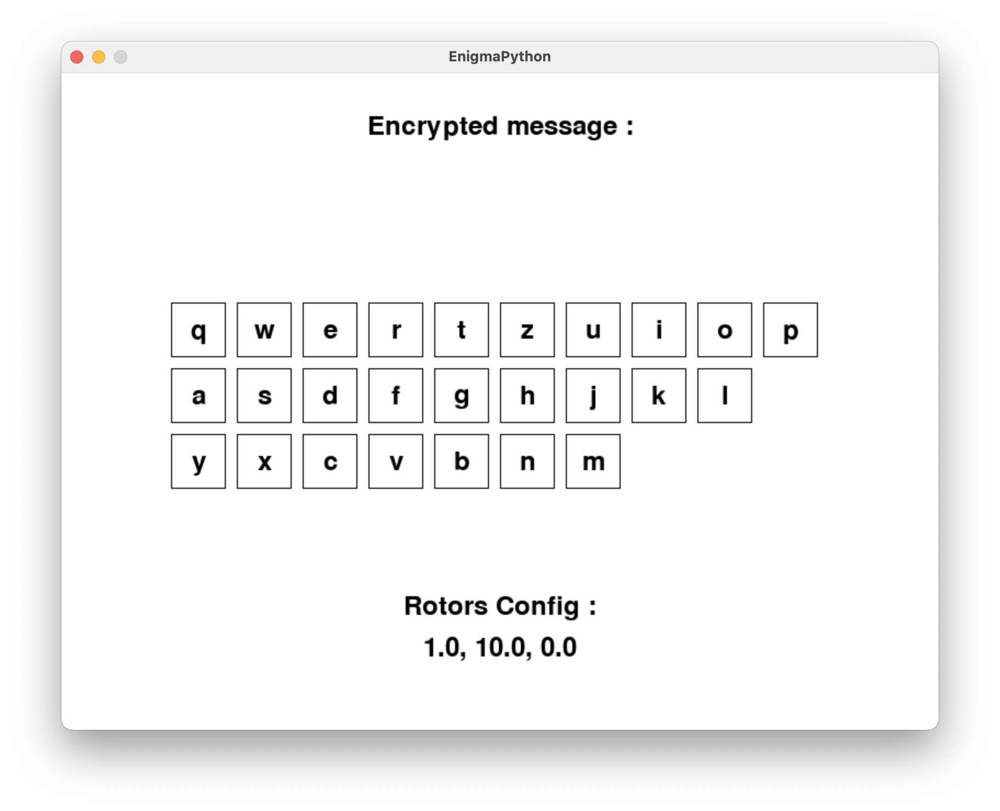
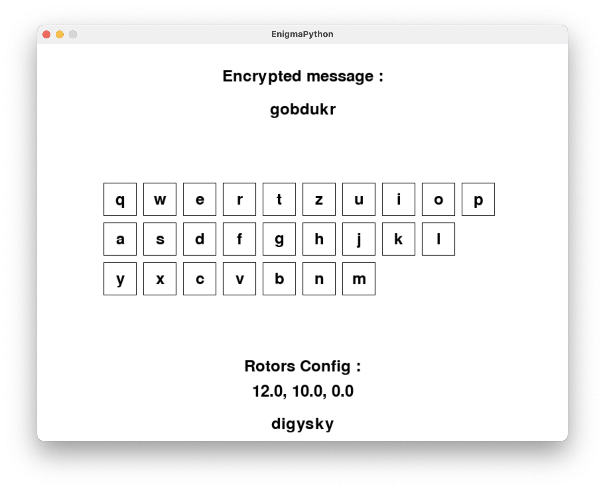

Voici un exemple de README pour votre programme Python reproduisant l'algorithme de la première machine Enigma utilisée par les Allemands pendant la Seconde Guerre mondiale, avec affichage utilisant Pygame et l'algorithme utilisant NumPy :

---

# Enigma Machine Simulator


## Description
This Python program simulates the workings of the Enigma machine, the encryption device used by the Germans during World War II. The simulation includes the plugboard, rotors, reflector, and lampboard, replicating the key components of the original Enigma machine.

## Features
- **Plugboard**: Simulates the plugboard connections. [in progress]
- **Rotors**: Implements the rotors mechanism with customizable rotor settings. [in progress]
- **Reflector**: Models the reflector component. [in progress]
- **Lampboard**: Displays the output of the machine.
- **Pygame**: Utilizes Pygame for graphical user interface. [in progress]

## Requirements
- Python 3.x
- Pygame library
- NumPy library

## Usage
1. Install Python 3.x if not already installed.
2. Install the required libraries:
   ```
   pip install pygame numpy
   ```
3. Run the program:
   ```
   python enigma.py
   ```
4. Use the graphical interface to input text and observe the encrypted output.

## Screenshots



## Acknowledgements
- This program is inspired by the original Enigma machine used during World War II.
- The Pygame library is used for graphical display.
- The NumPy library is used for numerical computations.

## License
This program is licensed under the MIT License. See the [LICENSE](LICENSE) file for details.

## Author
Created by [DIGYSKY]
